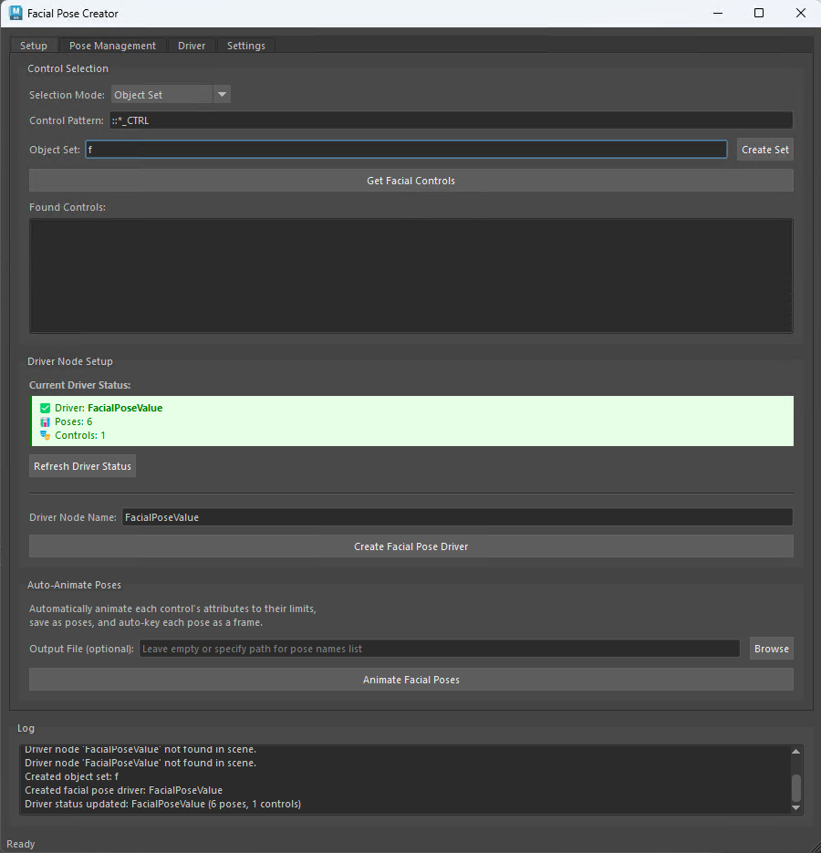

# Facial Pose Tools for Maya → Unreal Engine


**Bridge your Maya facial rigs to Unreal Engine pose assets with automated pose generation and animation curve export.**

## 🎯 Purpose

This tool solves a critical pipeline challenge: **transferring facial rig behavior from Maya to Unreal Engine**.

### The Problem

When bringing facial-rigged characters from Maya to Unreal Engine:
- Maya uses **bidirectional control attributes** (positive and negative values)
- Unreal Pose Assets require **unidirectional attributes** (0 to 1 normalized values)
- Manually creating poses for each facial movement is time-consuming and error-prone
- Animation curves need to be mapped and exported for each pose

### The Solution

**Facial Pose Tools** automates this workflow by:

1. **Breaking down each facial control** into individual poses (positive and negative ranges)
2. **Mapping each movement** to a separate driver attribute (0 to 1 range)
3. **Generating animation curves** that connect Maya controls to driver attributes
4. **Exporting pose data** that can be transferred to Unreal Engine Pose Assets
5. **Creating frame-by-frame animation** where each pose is keyed on its own frame

### Maya → Unreal Pipeline

```
Maya Facial Controls          Facial Pose Tools          Unreal Engine
─────────────────────         ─────────────────         ───────────────
jaw_CTRL.translateX           →  Driver Attributes     →  Pose Asset
  Range: -1.0 to 1.0             jaw_CTRL_translateX_1f0     Pose: jaw_open
                                 jaw_CTRL_translateX_minus1f0 Pose: jaw_close
                                 
eye_CTRL.translateY           →  eye_CTRL_translateY_1f0     Pose: look_up
  Range: -2.0 to 2.0              eye_CTRL_translateY_minus2f0 Pose: look_down
                                 
[Multiple Controls]           →  [Animation Curves]      →  [Curve Import]
                                 [Frame Mapping]             [Pose Matching]
```

## 🖼️ Interface



*The tool provides a clean, tab-based interface for setup, pose management, driver inspection, and settings configuration.*

## ✨ Key Features

### 🎭 Automated Pose Generation

- **Auto-decompose controls**: Each attribute's positive and negative ranges become separate poses
- **Driver node creation**: Central hub with one attribute per facial pose
- **Animation curve connections**: Automatic setup of curves from controls to driver
- **Frame-based output**: Each pose keyed on individual frame for easy export

### � Unreal-Ready Output

- **Pose name list**: Text file with all pose names matching driver attributes
- **Frame mapping**: Documentation showing which frame contains which pose
- **Normalized curves**: Driver attributes designed for 0-1 export to Unreal
- **One control per pose**: Clean separation for Pose Asset creation

### 🎯 Workflow Tools

- **Multiple selection modes**: Pattern matching, selection, object sets, or metadata
- **Custom attribute limits**: Override ranges for specific controls
- **Real-time validation**: Visual feedback on driver status and connections
- **Pose library**: Save and manage manual poses alongside auto-generated ones

## 📦 Installation

### Quick Install (Recommended)

1. **Download** `FacialPoseTools_v1.0.0.zip`
2. **Extract** the zip file
3. **Open Maya**
4. **Drag & drop** `install.py` into Maya's viewport
5. **Done!** Click the "Face" shelf button to launch

### What Gets Installed

The installer creates:
- **Package**: `Documents/maya/scripts/facialposecreator/`
- **Shelf Button**: "Face" button on Custom shelf
- **Module**: `Documents/maya/modules/facialposecreator.mod`

### Manual Launch

```python
import facialposecreator
facialposecreator.show_ui()
```

## 🚀 Quick Workflow: Maya to Unreal

### Step 1: Setup in Maya

1. **Select your facial controls** (or use pattern matching)
2. **Set driver node name** (e.g., "FacialPoseValue")
3. **Click "Get Facial Controls"** to validate selection
4. **Click "Create Facial Pose Driver"**

### Step 2: Generate Poses

1. **Click "Animate Facial Poses"**
2. **Specify output file** (optional): `C:/Export/facial_poses.txt`
3. Tool creates:
   - One driver attribute per pose (e.g., `jaw_CTRL_translateX_1f0`)
   - Animation curve from control to driver attribute
   - Keyframe on unique frame for each pose
   - Frame mapping file showing pose locations

### Step 3: Export to Unreal

#### Option A: Manual Transfer

1. **Review frame mapping** file to see all poses
2. **For each frame**, export the pose:
   - In Maya: Go to frame, select character mesh
   - Export deformed mesh or blend shape target
3. **In Unreal**: Create Pose Asset with matching names
4. **Import animation curves** from driver node

#### Option B: Automated Export (Recommended)

1. **Use Maya's export tools** to export animation:
   - Export FBX with animation on driver node
   - Or use custom export script reading driver attributes
2. **In Unreal**: 
   - Import FBX/animation
   - Create Control Rig with curve mappings
   - Match driver attribute names to Pose Asset poses
   - Animation curves drive pose weights

### Step 4: Verify in Unreal

1. **Check pose names** match between Maya driver and Unreal Pose Asset
2. **Test animation curves** drive correct poses
3. **Verify value ranges** (0-1 in Unreal, matched from Maya driver)

## � Understanding the Driver Node

### What is the Driver Node?

The **driver node** is a transform node in Maya that acts as a central hub for all facial poses:

```
FacialPoseValue (Driver Node)
├── jaw_CTRL_translateX_1f0 (0-1)         → Unreal Pose: jaw_open
├── jaw_CTRL_translateX_minus1f0 (0-1)    → Unreal Pose: jaw_close
├── eye_CTRL_translateY_2f0 (0-1)         → Unreal Pose: look_up
├── eye_CTRL_translateY_minus2f0 (0-1)    → Unreal Pose: look_down
└── ... (one attribute per pose)
```

### How It Works

1. **Maya Control** moves (e.g., `jaw_CTRL.translateX = -1.0`)
2. **Animation Curve** evaluates the control value
3. **Driver Attribute** receives normalized value (0 to 1)
4. **Export** driver attributes as animation curves
5. **Unreal** reads curves and applies to Pose Asset weights

### Why This Approach?

- ✅ **Single source of truth**: Driver node contains all pose data
- ✅ **Unreal-compatible**: Attributes are 0-1 range, ready for pose weights
- ✅ **Animation-ready**: Keyframes on driver can be exported directly
- ✅ **Organized**: Clear naming convention matches Maya to Unreal
- ✅ **Non-destructive**: Original controls unchanged, driver is separate

## 📋 Typical Use Cases

### Use Case 1: Character Facial Rig Export

**Scenario**: You have a character with 30+ facial controls in Maya, need to transfer to Unreal for animation.

**Workflow**:
1. Create driver node with all facial controls
2. Auto-generate poses (60+ poses from 30 controls)
3. Export each frame as blend shape target or pose
4. Create Unreal Pose Asset with matching names
5. Import driver animation curves
6. Animate using animation blueprint

### Use Case 2: Blend Shape Transfer

**Scenario**: Maya facial rig uses blend shapes, need pose-based system in Unreal.

**Workflow**:
1. Select blend shape target controls
2. Generate driver with one pose per blend shape
3. Keyframe driver attributes to drive blend shapes
4. Export driver animation
5. In Unreal: Create morphs matching pose names
6. Use driver curves to blend morphs

### Use Case 3: Corrective Shapes

**Scenario**: Need corrective poses for specific facial combinations.

**Workflow**:
1. Manually pose face with control combinations
2. Use "Save Pose" to capture corrective
3. Create driver attribute for the corrective
4. Export as additional pose in Unreal
5. Layer corrective over base poses

## 🔧 Advanced Tips

### Custom Attribute Ranges

If your controls have non-standard ranges:

1. Go to **Settings** tab
2. Add **Custom Limit Override**:
   - Attribute: `jaw_CTRL.translateX`
   - Min: `-5.0`
   - Max: `5.0`
3. Tool generates poses for full range

### Naming Conventions

Default naming: `{control}_{attribute}_{value}`

Examples:
- `jaw_CTRL_translateX_1f0` = jaw control, translateX, value 1.0
- `eye_CTRL_rotateY_minus2f5` = eye control, rotateY, value -2.5

**Tip**: This naming makes it easy to match in Unreal:
- Maya: `jaw_CTRL_translateX_1f0`
- Unreal Pose: `jaw_open` or keep same name for direct matching

### Exporting Only Specific Controls

1. Select controls you want to export
2. Use **"Current Selection"** mode
3. Create driver with only those controls
4. Generate poses only for selected

### Multiple Driver Nodes

For organized export, create separate drivers:
- `FacialPoseValue_Upper` - eyes, brows
- `FacialPoseValue_Lower` - jaw, mouth
- `FacialPoseValue_Correctives` - combination poses

Each driver can be exported separately to Unreal.

## 🔧 Troubleshooting

### "No valid controls found"

**Solution**: 
- Check your control naming pattern
- Use "Current Selection" mode and select controls manually
- Verify controls aren't in excluded nodes list

### "Driver node not found"

**Solution**:
- Click "Create Facial Pose Driver" first
- Check driver node name matches in Scene
- Use "Refresh Driver Status" button

### Animation curves not exporting to Unreal

**Solution**:
- Verify driver node has keyframes on attributes
- Export FBX with animation enabled
- Check Unreal import settings include animation curves
- Ensure curve names match Pose Asset names

### Poses don't match in Unreal

**Solution**:
- Check pose naming convention matches
- Verify attribute value ranges (Maya may be -1 to 1, Unreal needs 0 to 1)
- Review frame mapping file to confirm pose order
- Test individual poses in Maya before export

## � Documentation

- **INSTALL.md** - Detailed installation guide
- **FEATURE_AUTO_ANIMATE.md** - Auto-animation details
- **FEATURE_FRAME_POSE_MAPPING.md** - Frame mapping system
- **REFACTOR_DRIVER_NODE_ANIMATION.md** - Driver node architecture

## 📄 License

MIT License - Copyright (c) 2025 Nguyen Phi Hung

## 👤 Author

**Nguyen Phi Hung** - Technical Artist / Pipeline Developer

GitHub: [@josephkirk](https://github.com/josephkirk)

---

<div align="center">

**Built for Maya → Unreal facial animation pipeline**

[⬆ Back to Top](#facial-pose-tools-for-maya--unreal-engine)

</div>
